# Exercise Tracker App

This is a web application designed to track daily exercise data and monitor your fitness progress over time. Users can
log their daily exercise routines, view detailed reports on their activities, and keep track of their goals such as
calories burned, steps taken, distance covered, and heart rate.

The backend is built using Python with Flask and SQLAlchemy for database interaction, and the frontend is built using
HTML, W3.CSS, Charting Library (canvasjs) and plain JavaScript to display data to the browser.

---

## Table of Contents

1. [Introduction](#introduction)
2. [Features](#features)
3. [Technology Stack](#technology-stack)
4. [How to Use](#how-to-use)
5. [Running the Application Locally](#running-the-application-locally)
6. [Database Schema](#database-schema)
7. [Endpoints](#endpoints)
8. [Importance of Daily Exercise Tracking](#importance-of-daily-exercise-tracking)

---

## Introduction

The Exercise Tracker App helps individuals monitor their daily fitness activities. Users can log their steps, distance,
calories burned, heart rate, and duration of exercises. The app also generates reports for better tracking of progress
over time.

---

## Features

- **User Authentication**: Users can sign up, log in, and log out of the app.
- **Exercise Tracking**: Users can log their daily exercise data including steps taken, distance, calories burned, heart
  rate, and exercise duration.
- **Dashboard**: Users can view their exercise data for the past 7 days on a dashboard.
- **Exercise Reports**: Users can generate reports based on different metrics such as steps, distance, calories, heart
  rate, and exercise duration.
- **Data Visualization**: The app provides visual feedback on how well users are meeting their fitness goals.

---

## Technology Stack

- **Backend**: Python, Flask, SQLAlchemy
- **Frontend**: HTML, W3.CSS, JavaScript, Canvasjs
- **Database**: SQLite
- **JWT Authentication**: JSON Web Tokens (JWT) for session management
- **Logging**: Rotating file handler for logging with `logging` module

---

## How to Use

1. **Sign Up**: Create a new user account by providing a username, email, and password.
2. **Login**: Log in using your username or email and the password you set during signup.
3. **Track Exercise**: After logging in, you can add daily exercise entries including steps, distance, calories burned,
   and more.
4. **View Reports**: Access the reports section to view data for steps, calories burned, heart rate, and other metrics
   over the last 7 days.
5. **Dashboard**: Your dashboard displays a quick overview of your latest exercise data.

---

## Running the Application Locally

To run the Exercise Tracker app locally, follow these steps:

### Prerequisites

- Python 3.6 or later
- `pip` (Python package manager)
- A text editor or IDE of your choice (e.g., VSCode)

### Installation

1. Clone the repository:
    ```bash
    git clone https://github.com/jeetendra29gupta/exercise-tracker.git
    cd exercise-tracker
    ```

2. Create a virtual environment:
    ```bash
    python3 -m venv venv
    source venv/bin/activate  # On Windows, use `venv\Scripts\activate`
    ```

3. Install dependencies:
    ```bash
    pip install -r requirements.txt
    ```

4. Set up environment variables:
   Create a `.env` file in the root directory with the following content:
    ```bash
    SECRET_KEY=your-secret-key-here
    FLASK_DEBUG=True
    SESSION_PERMANENT=True
    PERMANENT_SESSION_LIFETIME=30
    LOG_LEVEL=INFO
    SQLALCHEMY_DATABASE_URL=sqlite:///./exercise-tracker.db
    ```

5. Initialize the database if it is not initialized by running the following command:
    ```bash
    python
    >>> from models import init_db
    >>> init_db()
    ```

6. Run the app:
    ```bash
    python main_app.py
    ```

7. Open your browser and navigate to `http://127.0.0.1:8181` to access the application.

---

## Database Schema

The app uses a relational database with two main tables: `users` and `daily_exercise_tracker`.

### Users Table

| Field        | Type     | Description                           |
|--------------|----------|---------------------------------------|
| `id`         | Integer  | Primary key, auto-increment           |
| `username`   | String   | Unique username, required             |
| `fullname`   | String   | Full name of the user                 |
| `email`      | String   | Unique email address, required        |
| `password`   | Text     | Hashed password, required             |
| `is_active`  | Boolean  | Account active status (default: True) |
| `created_at` | DateTime | Account creation timestamp            |
| `updated_at` | DateTime | Last account update timestamp         |

### Daily Exercise Tracker Table

| Field               | Type     | Description                                   |
|---------------------|----------|-----------------------------------------------|
| `id`                | Integer  | Primary key, auto-increment                   |
| `date`              | DateTime | Date and time of the exercise entry           |
| `steps_taken`       | Integer  | Number of steps taken                         |
| `distance`          | Float    | Distance traveled in kilometers or miles      |
| `calories_burned`   | Float    | Calories burned during the exercise           |
| `max_heart_rate`    | Integer  | Maximum heart rate during the exercise        |
| `min_heart_rate`    | Integer  | Minimum heart rate during the exercise        |
| `avg_heart_rate`    | Integer  | Average heart rate during the exercise        |
| `exercise_duration` | Integer  | Duration of the exercise in minutes           |
| `user_id`           | Integer  | Foreign key referencing `users.id`            |
| `is_active`         | Boolean  | Exercise record active status (default: True) |
| `created_at`        | DateTime | Exercise record creation timestamp            |
| `updated_at`        | DateTime | Last update timestamp for the exercise record |

---

### Endpoints
- POST /login: Log in with username or email.
    >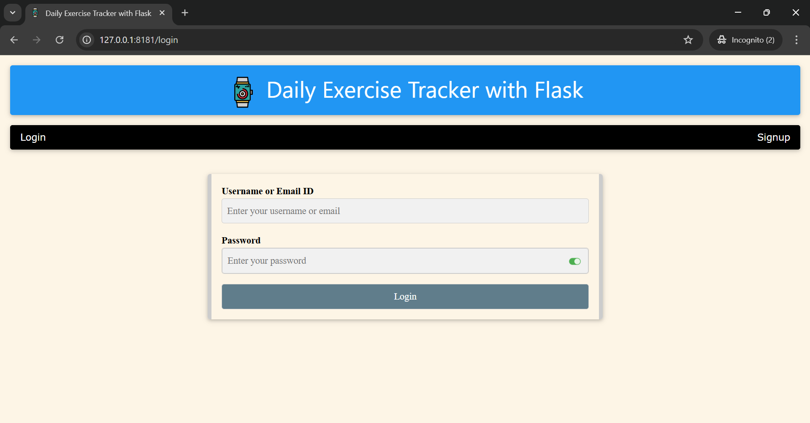 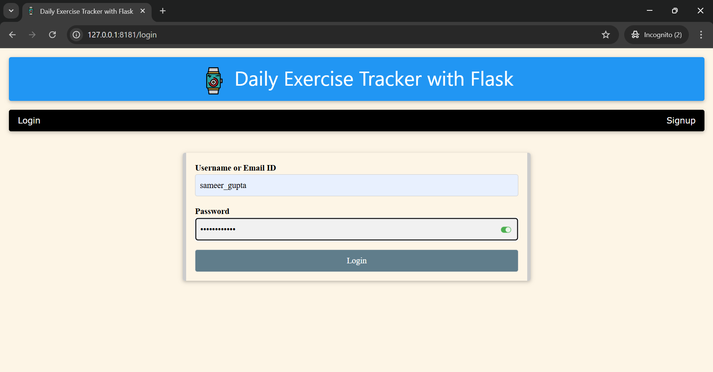 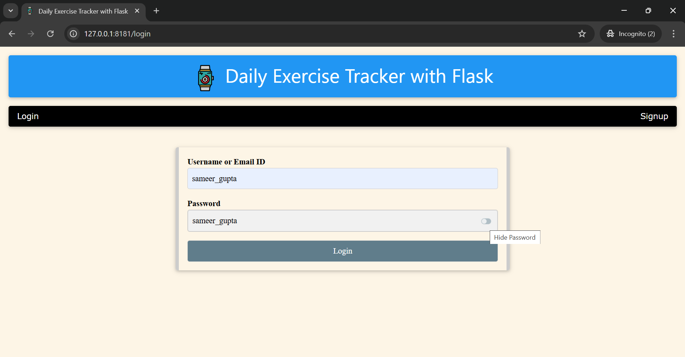
- POST /signup: Create a new user account.
    >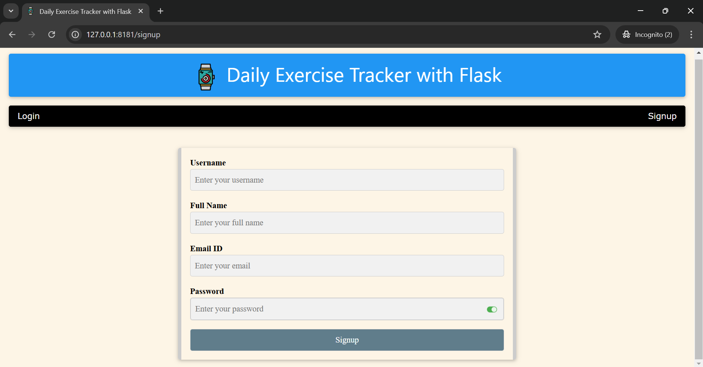 
- GET /dashboard: View your exercise dashboard (only for logged-in users).
    >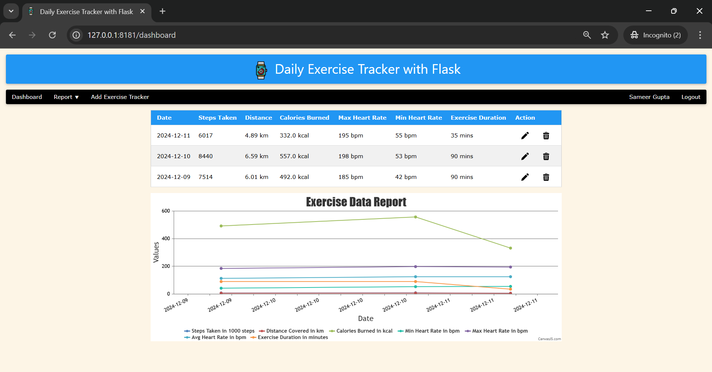
- POST /add_exercise_tracker: Add a new exercise entry.
    >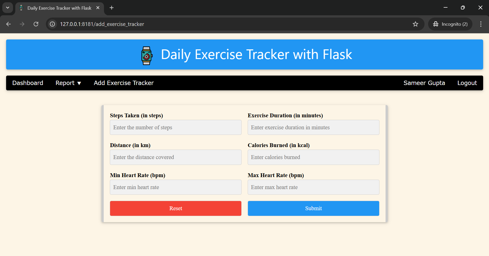
- GET /report/<action>: View exercise reports based on various metrics (steps, calories, etc.).
    >  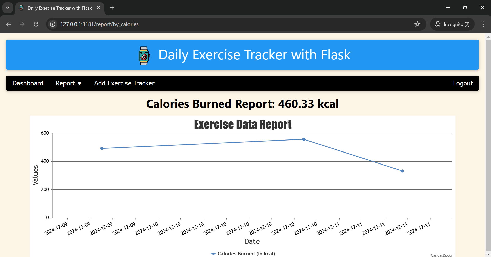 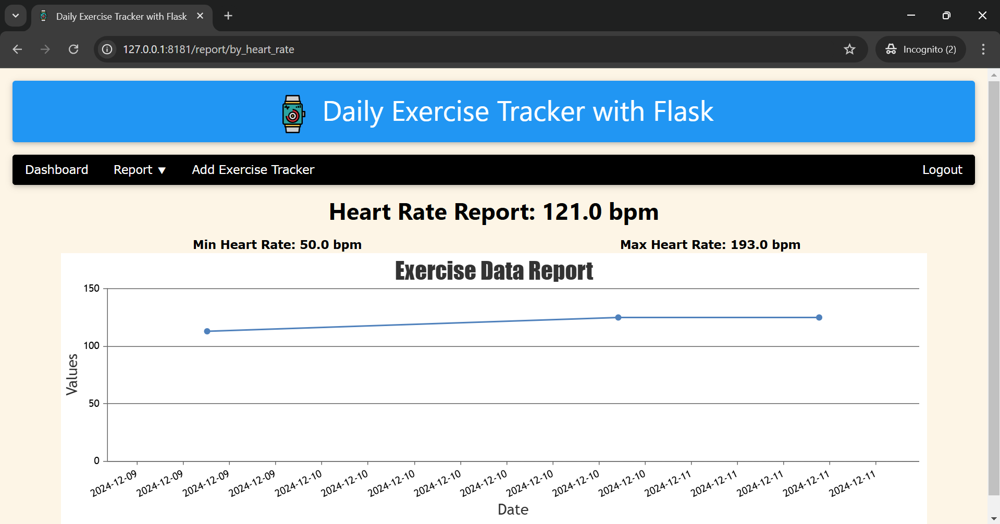 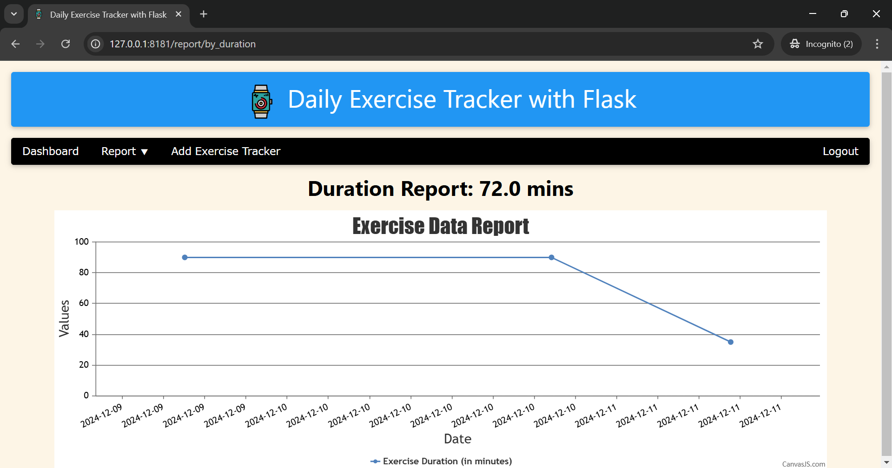 
- GET /update_exercise_tracker/int:id: Update a specific exercise entry.
    >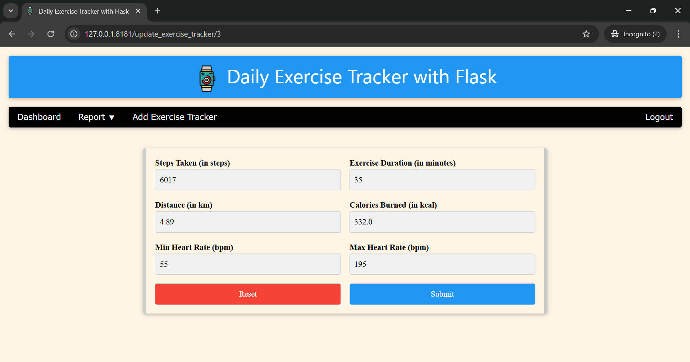
- GET /delete_exercise_tracker/int:id: Delete a specific exercise entry.
    >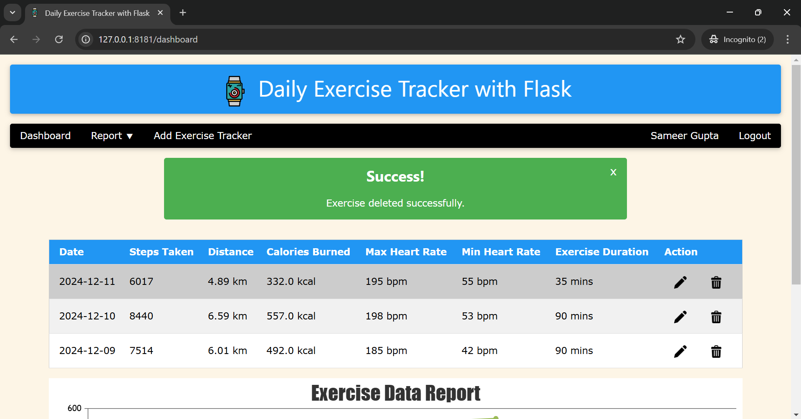
- GET /logout: Log out and clear session data.
    >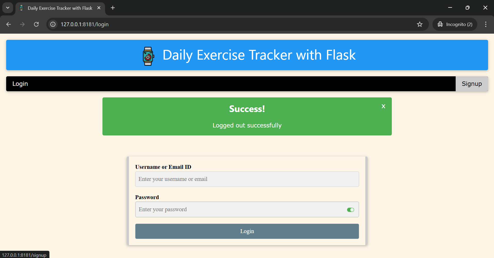

---

## Importance of Daily Exercise Tracking

Tracking daily exercises is crucial for:

1. **Motivation & Consistency**: Keeping a record of your workouts can help stay motivated and maintain a consistent
   routine.
2. **Progress Monitoring**: By tracking metrics like steps, calories burned, and exercise duration, you can measure
   improvements over time and adjust your goals.
3. **Health Insights**: Regularly logging exercise data provides insights into your overall health, helping you detect
   trends and make informed lifestyle choices.
4. **Goal Setting**: Helps in setting achievable fitness goals and monitoring your progress towards them.
5. **Accountability**: With detailed records, you hold yourself accountable to your fitness goals, ensuring you stay on
   track.

---

